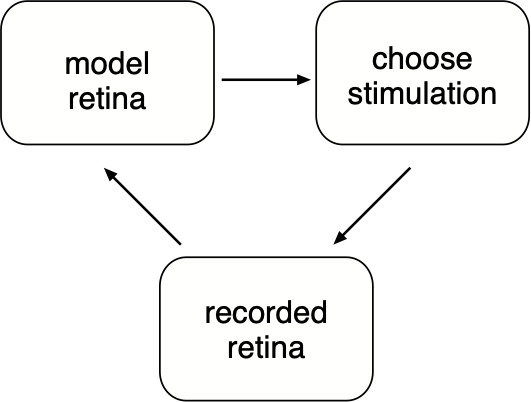

# Algorithms for efficient calibration of electrically evoked responses

## Overview
For efficient closed loop electrical response calibration, different steps must be repeated interatively - 

Different modules for the three components are included in different modules: 
* The ground-truth retina gives spikes for different stimulation patterns (`system_actual.py`).
* The spikes are used to generate a response model (`system_model.py`).
* Stimulation patterns are selected based on estimated response model for the retina (`adaptive_stim_alg.py`)

Additionally, different modules are provided for analyses : 
* Simulating a closed loop experiment (`adaptive_experiment.py`)
* Metrics to keep track of performance (`metrics.py`)

For more details on different components and analyses, see this [report](doc/report.pdf).

## How to use the code

Below, we show the different variants of different components mentioned above and how to declare them.
We assume that the code is run on smokestack with tensorflow installed. 

---
### Recorded retina

For a given set of stimulation patterns, spikes could be generated from the recorded retina by either sampling according to a previously measured dictionary (option 1) or sampling spikes from electrical spike sorting applied or raw voltage traces from a previous experiment (option 2).

```python

# Object corresponding to ground-truth retina.
import system_actual

# Option 1 - randomly sample spike spikes based on a ground-truth dictionary.
retina = system_actual.PerfectlyObservedRetina(dictionary[:, :38, :], np.squeeze(cellID_list))

# Option 2 - sample spikes from output of electrical spike sorting applied on an experimental recording.
ei_src = '/Volumes/Analysis/2015-11-09-3/data000/data000_ei_nps.mat'
elec_coords_loc = '/Volumes/Lab/Users/AlexG/pystim/files/elec-coords/512Coords.mat'
art_basis = '/Volumes/Lab/Users/bhaishahster/GITs/matlab/private/nishal/Prosthesis/pipeline/notebooks/basis.mat'
preprocessed_data = '/Volumes/Analysis/2015-11-09-3/data001-data002'
retina = system_actual.SampleRealRetina(preprocessed_data, 
                                        ei_src, elec_coords_loc, 
                                        art_basis, 
                                        cids_use=np.squeeze(cellID_list))

```

Note that the `SampleRealRetina` object implements a novel spike sorting method that exploits an artifact basis learnt from previous experiments. If you want to just run spike sorting, you can declare the `retina` object as outlined above in option 2 and run the following steps:  

```python 
# How to run electrical spike sorting.
n_elecs = 512
n_amps = 38
n_trials = 25
trial_elec_amps = np.ones((n_elecs, n_amps)) * n_trials  # choose number of trials to spike sort for each electrode and amplitude
spks_coll = retina.stimulate(trial_elec_amps.astype(np.int32))  # run spike sorting. 

```

### Model retina

For a given set of recorded spikes, the response probabilities for each tuple of (cell, electrode) could either be modeled independently (option 1) or jointly by using priors such as spike amplitudes (option 2).

```python
## Object corresponding to inferred retina based on measurements.
import system_model

# Option 1 - independent electrode-cells.
system_model_obj = system_model.Model(retina.cids)

# Option 2 - Joint model across multiple electrode-cell pairs.
ei, ei_cids = ss_util.get_ei_data(ei_src)
xy_priors = ss_util.get_xy_priors(ei_xy_prior_src)
system_model_obj = system_model.Hierarchical2(ei, retina.cids, 
                                              use_prior=True, vi_global=True,
                                              xy_priors=xy_priors)
system_model_obj.set_default_prior()
```

### Choosing stimulations

To choose current patterns, we could either stimulate each electrode-amplitude uniformly (option 1), adaptively based on uncertainty in estimated response probabilities (option 2) or adaptively based on uncertainty in decoded stimulus (option 3)

```python 
## Object corresponding to stimulation algorithm.
import adaptive_stim_alg

# Option 1 : Non-adaptive algorithm
stim_alg = adaptive_stim_alg.fixed_stim

# Option 2 : Adaptive algorithm, no decoder used
stim_alg = lambda *x: adaptive_stim_alg.adaptive_stim_5(*x, use_decoder=False)

# Option 3: Adaptive algorithm, use decoder
stim_alg = lambda *x: adaptive_stim_alg.adaptive_stim_5(*x, use_decoder=True)

```

### Metrics

To compare the estimated response probabilities with the ground truth, we use a `metrics` object.

```python 
## Set-up the metrics object that keeps track of calibration performance.
import metrics
metrics_obj = metrics.Metrics(dictionary[:, :38, :], np.squeeze(cellID_list))  # first arg is supposed be the target.
```

### Experiment

Finally, we run the loop by using the objects declared above. 

```python 
## Run the adaptive experiment
import adaptive_experiment
metrics_obj = adaptive_experiment.adaptive_experiment(metrics_obj, system_model_obj, retina, 
                                                          stim_alg, ntrials_per_phase=2, 
                                                          trials_max = 25, n_amps=38, 
                                                          save_name='expt_name')
## Plot the error v/s trials. 
plt.plot(np.cumsum(metrics_obj.nstims_log) / (512 * 38), metrics_obj.loss_sig, '-*')
```

Look inside `adaptive_experiment.py` to run each step of the experiment individually. Using different options for each component of the closed loop experiment, we can run adaptive/non-adaptive stimulation using real/simulated retinas and independent/joint models. 

                                                                     
---
TODO(bhaishahster): Add comments in code.
